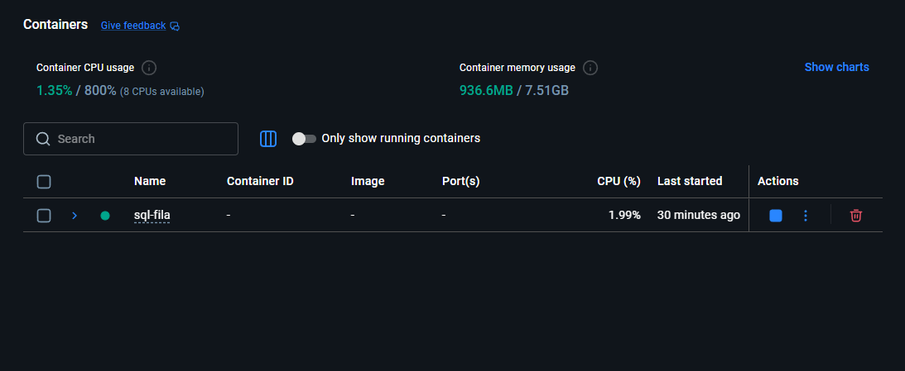
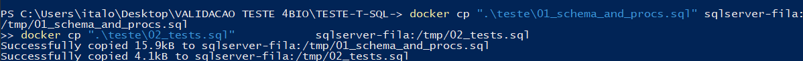
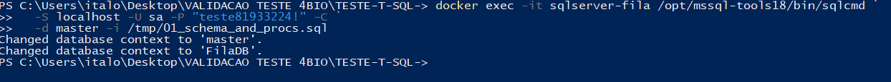
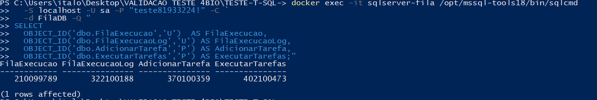
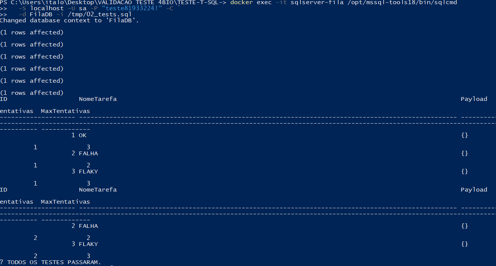
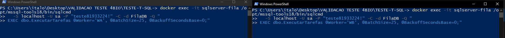
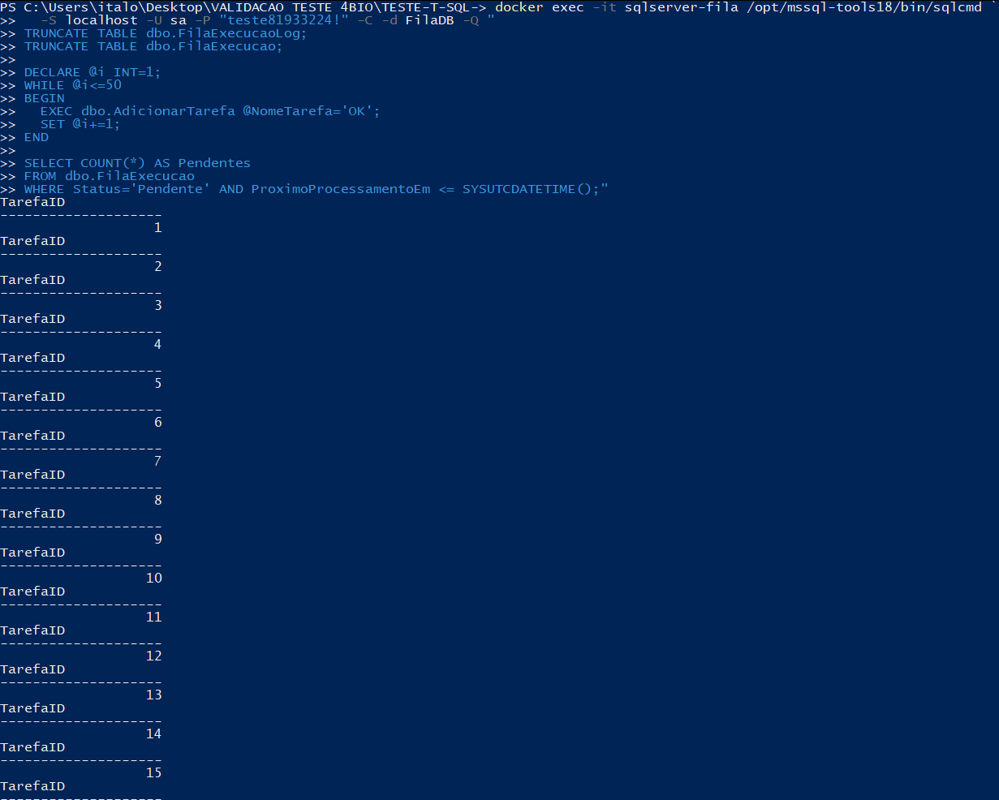
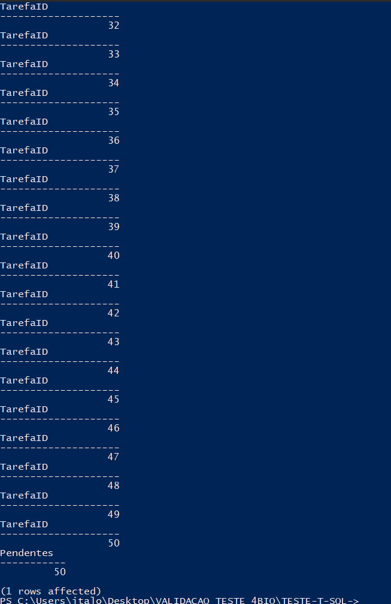
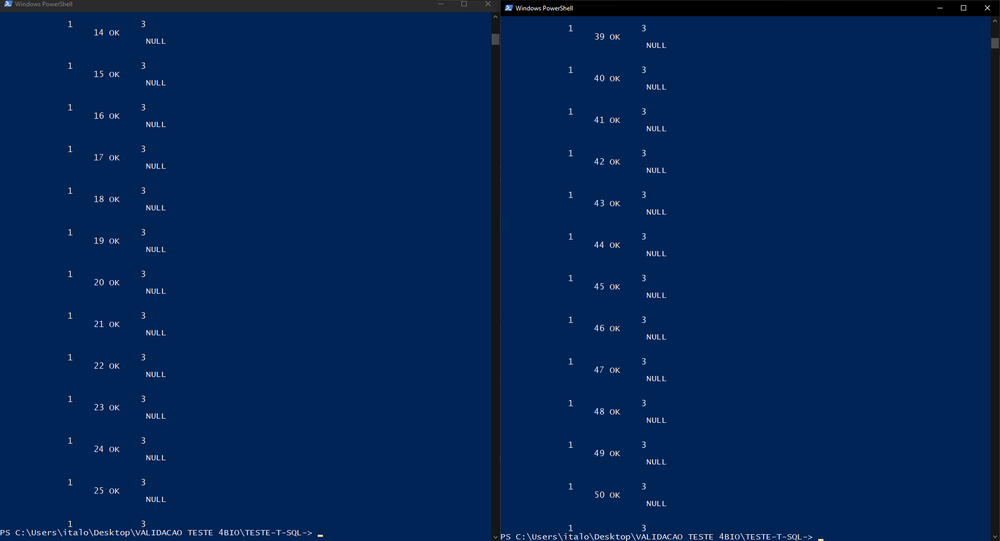
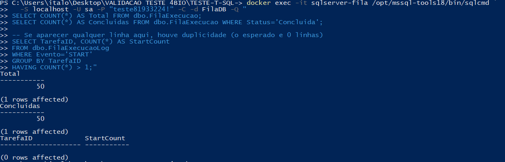

# Fila de Execucao (SQL Server) - T-SQL + Docker

Eu implementei uma fila de execucao em SQL Server para processar tarefas de forma concorrente e segura.
A ideia e permitir varios "workers" rodando em paralelo sem duplicar execucoes.

---

## O que eu fiz

- Tabela `dbo.FilaExecucao` para guardar tarefa, status, tentativas, agendamento e ultimo erro.
- Tabela `dbo.FilaExecucaoLog` para auditoria (CLAIM/START/SUCCESS/FAIL).
- Procedure `dbo.AdicionarTarefa` para inserir novas tarefas.
- Procedure `dbo.ExecutarTarefas` para claim atomico e execucao.
- Retry/backoff: em falha a tarefa volta para `Pendente` com `ProximoProcessamentoEm` no futuro.

---

## Requisitos

- Docker + Docker Compose
- Container SQL Server 2022 (imagem Microsoft)
- PowerShell (Windows)

---

## Estrutura do projeto

```
.
├─ docs/
│  └─ prints/
├─ sql-fila/
│  └─ docker-compose.yml
├─ teste/
│  ├─ 01_schema_and_procs.sql
│  └─ 02_tests.sql
└─ README.md
```

---

## Subindo o banco com Docker

Na pasta `sql-fila/`:

```powershell
cd .\sql-fila
docker compose up -d
docker ps
```

O container esperado e `sqlserver-fila`.

---

## Criando schema e procedures (script 01)

A partir da raiz do projeto:

```powershell
# Copio os scripts para dentro do container
docker cp ".\teste\01_schema_and_procs.sql" sqlserver-fila:/tmp/01_schema_and_procs.sql
docker cp ".\teste\02_tests.sql" sqlserver-fila:/tmp/02_tests.sql

# Executo o schema/procs
docker exec -it sqlserver-fila /opt/mssql-tools18/bin/sqlcmd `
  -S localhost -U sa -P "teste81933224!" -C `
  -d master -i /tmp/01_schema_and_procs.sql
```

Check rapido: objetos existem?

```powershell
docker exec -it sqlserver-fila /opt/mssql-tools18/bin/sqlcmd `
  -S localhost -U sa -P "teste81933224!" -C `
  -d FilaDB -Q "
SELECT
  OBJECT_ID('dbo.FilaExecucao','U')  AS FilaExecucao,
  OBJECT_ID('dbo.FilaExecucaoLog','U') AS FilaExecucaoLog,
  OBJECT_ID('dbo.AdicionarTarefa','P') AS AdicionarTarefa,
  OBJECT_ID('dbo.ExecutarTarefas','P') AS ExecutarTarefas;"
```

---

## Rodando os testes automatizados (script 02)

```powershell
docker exec -it sqlserver-fila /opt/mssql-tools18/bin/sqlcmd `
  -S localhost -U sa -P "teste81933224!" -C `
  -d FilaDB -i /tmp/02_tests.sql
```

O script de testes cobre:
- criacao e execucao de tarefas
- falha permanente (`FALHA`)
- falha transitoria (`FLAKY`) + retry
- validacoes de status e logs

---

## Demonstracao: concorrencia (2 workers em paralelo)

1. Preparar 50 tarefas `OK`.

```powershell
docker exec -it sqlserver-fila /opt/mssql-tools18/bin/sqlcmd `
  -S localhost -U sa -P "teste81933224!" -C -d FilaDB -Q "
TRUNCATE TABLE dbo.FilaExecucaoLog;
TRUNCATE TABLE dbo.FilaExecucao;

DECLARE @i INT=1;
WHILE @i<=50
BEGIN
  EXEC dbo.AdicionarTarefa @NomeTarefa='OK';
  SET @i+=1;
END

SELECT COUNT(*) AS Pendentes
FROM dbo.FilaExecucao
WHERE Status='Pendente' AND ProximoProcessamentoEm <= SYSUTCDATETIME();"
```

2. Rodar dois workers (em dois terminais).

Terminal 1:

```powershell
docker exec -it sqlserver-fila /opt/mssql-tools18/bin/sqlcmd `
  -S localhost -U sa -P "teste81933224!" -C -d FilaDB -Q "
EXEC dbo.ExecutarTarefas @Worker='WA', @BatchSize=25, @BackoffSecondsBase=0;"
```

Terminal 2:

```powershell
docker exec -it sqlserver-fila /opt/mssql-tools18/bin/sqlcmd `
  -S localhost -U sa -P "teste81933224!" -C -d FilaDB -Q "
EXEC dbo.ExecutarTarefas @Worker='WB', @BatchSize=25, @BackoffSecondsBase=0;"
```

3. Validar: 50 concluidas e 0 duplicidade.

```powershell
docker exec -it sqlserver-fila /opt/mssql-tools18/bin/sqlcmd `
  -S localhost -U sa -P "teste81933224!" -C -d FilaDB -Q "
SELECT COUNT(*) AS Total FROM dbo.FilaExecucao;
SELECT COUNT(*) AS Concluidas FROM dbo.FilaExecucao WHERE Status='Concluida';

-- Se aparecer qualquer linha aqui, houve duplicidade (o esperado e 0 linhas)
SELECT TarefaID, COUNT(*) AS StartCount
FROM dbo.FilaExecucaoLog
WHERE Evento='START'
GROUP BY TarefaID
HAVING COUNT(*) > 1;"
```

---

## Prints

Subindo o banco (Docker):


Docker Compose em execucao:


Schema e procedures:


Check rapido dos objetos:


Testes automatizados (script 02):


Testes OK:


Concorrencia - Worker 1:


Concorrencia - Worker 2:


Resultado (concluidas):


Validacao de duplicidade:


---

## Decisoes tecnicas (resumo)

Claim atomico e concorrencia segura:
- Eu uso `UPDLOCK` para evitar que dois workers peguem a mesma linha ao mesmo tempo.
- Eu uso `READPAST` para pular linhas bloqueadas e manter o throughput.
- Eu ordeno por `ID` para manter FIFO no claim.

Ordem de execucao:
- Eu garanto a ordem de selecao (FIFO) no claim.
- Com multiplos workers, a conclusao pode ocorrer fora de ordem, e isso e esperado.
- Se precisar ordem estrita de conclusao, eu uso 1 worker por fila ou particiono por chave e processo em serie.

Execucao fora de transacao longa:
- Eu nao seguro locks durante a execucao da tarefa.
- Eu atualizo status e registro logs ao final.

Retry e backoff:
- Eu incremento tentativas no claim.
- Eu reagendo a tarefa para o futuro (`ProximoProcessamentoEm`).
- Ao estourar `MaxTentativas`, eu marco como `Falhou`.
